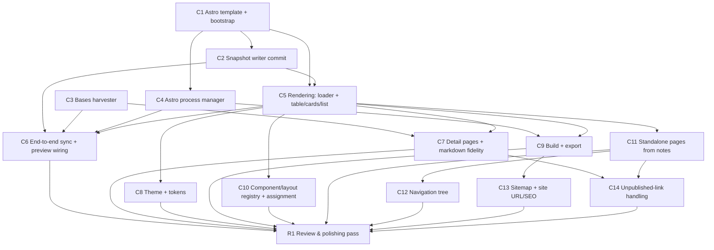

# IMPLEMENTATION_PLAN.md — Specorator Astro Viewer

> Status: **active**. This plan turns the normative spec in
> [`REQUIREMENTS.md`](REQUIREMENTS.md) and the architecture in
> [`DESIGN.md`](DESIGN.md) into **independently shippable chunks**, each sized to be
> driven to completion by a dedicated subagent running a **RALPH loop**, and closed
> out by a **review & polishing pass** (§R1). Vocabulary is in
> [`CONTEXT.md`](../CONTEXT.md).

This file is the _execution_ contract; `REQUIREMENTS.md` remains the _normative_ one.
If they ever disagree, REQUIREMENTS wins and this plan is corrected.

## 0. How to use this plan

### 0.1 The RALPH loop (one per chunk)

A **RALPH loop** runs a single dedicated subagent repeatedly against one stable chunk
spec until that chunk's acceptance criteria are all met. Each iteration:

1. **Re-read** the chunk spec + its acceptance checklist, then `git log --oneline` and
   the working diff to see what is already done.
2. **Pick the smallest next increment** that moves one unchecked criterion toward done.
3. **Implement** it, holding every invariant in §0.2.
4. **Verify** — run `npm run verify`. If red, fix that before anything else.
5. **Commit** a small Conventional Commit scoped to the chunk (e.g.
   `feat(harvester): read grouped entries from onDataUpdated`).
6. **Re-evaluate** the checklist. If any box is unticked, loop. If all are ticked,
   **stop and report** — do not gold-plate.

The loop's terminal state is: **every acceptance box ticked AND `npm run verify` green
AND the required tests exist.** Stopping there is the goal; scope creep is a failure.

### 0.2 Invariants (must hold on every iteration of every chunk)

- `npm run verify` stays green; **never** bypass hooks (`--no-verify`, etc.).
- `src/core/**` stays **pure** — no `obsidian`, no `node:*`, no I/O. Enforced by
  `eslint-plugin-boundaries` + `dependency-cruiser`.
- Real logic lives in **deep core modules behind small ports**; adapters stay thin.
  Don't add shallow pass-through modules (see CONTEXT.md "deletion test").
- New `src/core/**` code is **unit-tested with in-memory fakes** (no `obsidian`); core
  branch coverage stays **≥ 90%**.
- **Native Obsidian only** (Bases + Web Viewer core plugins); **desktop-only**;
  `child_process` spawns **only the project-local toolchain**, never content-derived
  commands.
- **Conventional Commits** (commitlint-enforced); prefer many small commits.
- When a new domain term crystallizes, add it to `CONTEXT.md`. If a decision changes,
  update the relevant `DESIGN.md` decision (Dn) and `REQUIREMENTS.md` requirement.

### 0.3 Running chunks with subagents

- Launch **one subagent per chunk** using the template in **Appendix A**, pointing it at
  this file and a chunk ID. The agent owns that chunk's RALPH loop end-to-end.
- **Parallelize only** chunks with no dependency edge **and** no overlapping files (see
  the graph in §2). Run parallel chunks in **isolated git worktrees**, then integrate one
  at a time, re-running `npm run verify` after each merge.
- **Sequence** dependent chunks; after a chunk lands, re-baseline (pull, `npm run verify`)
  before launching its dependents.
- A chunk that grows beyond its acceptance criteria should be **split**, not stretched.

### 0.4 Definition of done (per chunk)

- All acceptance-criteria boxes ticked.
- `npm run verify` green (typecheck → lint → format:check → depcruise → test:coverage →
  build), locally and in CI.
- Tests added per the chunk's "Tests" line; core coverage ≥ 90%.
- Docs touched if the chunk introduced terms/decisions.
- A short PR (or commit series) that a reviewer can read in one sitting.

## 1. Where we are now (Phase 0 — done)

Scaffold complete and gated: ports & adapters, route planning (`routing.ts`), the
`SyncSite` and `PreviewSite` use-cases, native-settings config (`SettingsStore` +
`SiteSettingTab`), the full toolchain (esbuild, typed ESLint, Prettier, Vitest,
dependency-cruiser, husky, commitlint, release-please, Dependabot, CI = `npm run verify`).
**All adapters except settings are intentional stubs** that throw "not implemented yet":
`BasesHarvesterAdapter`, `FsSnapshotWriter`, `AstroProcessAdapter`. The chunks below fill
those in and build the Astro side.

## 2. Chunk dependency graph



**Parallel-safe pairs (disjoint files):** C2 ∥ C3; once C1 lands, C4 ∥ C2 ∥ C3; after C5,
{C7, C8, C10, C11} are largely parallel. **Phase 1 (MVP):** C1–C9. **Phase 2 (full
website):** C10–C14. **Close-out:** R1.

## 3. Phase 1 — MVP chunks

### C1 — Astro template + bootstrap

- **Goal:** ship a bundled Astro project template and scaffold it into the plugin data
  folder (`<pluginDir>/astro`) on first run, install dependencies, and surface
  install/build errors in a visible channel. (FR-9, FR-11a; DESIGN §5.9)
- **Depends on:** none. **Blocks:** C2, C4, C5.
- **Touches:** new `templates/astro/**` (template-owned vs user-owned dirs per FR-11a); a
  new `ProjectBootstrapPort` in `core/ports.ts` + adapter in `src/adapters/`; a thin core
  use-case `EnsureProject` that decides whether bootstrap is needed; `esbuild.config.mjs`
  / release packaging so the template ships with the plugin; `main.ts` wiring.
- **Contract:** `ProjectBootstrapPort.ensureProject(): Promise<{ projectDir: string }>` —
  idempotent; safe to call before every sync/preview.
- **Acceptance criteria:**
    - [ ] On a clean vault, the command scaffolds `astro/` with a runnable Astro project
          and installs deps (offline failure is reported, not swallowed — D10).
    - [ ] Template-owned vs user-owned directories are separated; re-bootstrap never
          overwrites user files (FR-11a).
    - [ ] `EnsureProject` is pure and unit-tested (decision logic only); the file/process
          work lives in the adapter.
    - [ ] The shipped artifact includes the template (verify the release/zip contents).
- **Tests:** core `EnsureProject` decision logic with a fake bootstrap port.
- **Out of scope:** rendering, harvesting, dev server.

### C2 — Snapshot writer (`commit`)

- **Goal:** implement `FsSnapshotWriter.commit(snapshots)` to atomically replace the
  Astro project's data directory with the given snapshot set. (FR-3; DESIGN §5.2)
- **Depends on:** C1 (data-dir layout). **Parallel with:** C3, C4. **Blocks:** C5, C6.
- **Touches:** `src/adapters/fs-snapshot-writer.ts` only (the port is already
  `commit(snapshots: ViewSnapshot[])`).
- **Contract:** stage to a temp dir, fsync, swap into place; a failed commit leaves the
  previous data dir intact (atomicity owned by the writer, not the caller).
- **Acceptance criteria:**
    - [ ] Writes one JSON file per snapshot under the project data dir, plus any index the
          loader (C5) needs.
    - [ ] Partial failure mid-write never leaves a half-written data dir (temp-dir + swap).
    - [ ] Uses `normalizePath` for vault-relative paths; writes via Node `fs` only.
    - [ ] An adapter-level test against a temp directory covers commit + replace + failure.
- **Tests:** adapter test using a real temp dir (`node:fs`/`node:os.tmpdir`).
- **Out of scope:** the snapshot's content (that's C3) and rendering (C5).

### C3 — Bases harvester

- **Goal:** implement `BasesHarvesterAdapter.harvest(target)` — register a Bases view,
  mount it transiently, and read evaluated entries from `onDataUpdated` into a
  `ViewSnapshot`, mirroring the user's chosen view config (type/order/groupBy). (FR-1,
  FR-2; DESIGN §5.1) **This is the highest-risk chunk** — no headless API exists.
- **Depends on:** none (uses the existing `ResolvedTarget` → `ViewSnapshot` contract).
  **Parallel with:** C2, C4. **Blocks:** C6, C7.
- **Touches:** `src/adapters/bases-harvester-adapter.ts`; possibly a small pure mapper in
  `core/` (Bases `Value` → `CellValue`) behind no new port.
- **Contract:** `harvest(target) → ViewSnapshot` matching `domain/types.ts`; pure mapping
  logic (Value → CellValue, grouping shape) lives in `core/` and is unit-tested; the
  mounting/`onDataUpdated` I/O lives in the adapter.
- **Acceptance criteria:**
    - [ ] Mounts a registered Bases view for a `.base` target, waits for `onDataUpdated`,
          and returns a populated `ViewSnapshot` (groups, order, values).
    - [ ] Reads view config via `this.config.getOrder()` / `getDisplayName()`; does **not**
          reimplement filters/formulas.
    - [ ] Errors (`ErrorValue`, Bases disabled → `registerBasesView` false) are surfaced
          clearly (FR-10), not swallowed.
    - [ ] The transient leaf is always torn down (no leaked leaves), even on error.
    - [ ] Value→`CellValue` and grouping mappers are pure and unit-tested in `core/`.
- **Tests:** pure mapper tests in `core/`; the adapter mounting path is exercised manually
  (documented in the PR) since it needs a live Bases view.
- **Out of scope:** writing to disk (C2), rendering (C5). If mounting proves impossible,
  **stop and escalate** — this invalidates DESIGN §5.1.

### C4 — Astro process manager

- **Goal:** implement `AstroProcessAdapter.startDev()/build()/stop()` — spawn the
  project-local Astro binary, parse the dev URL from stdout, and **kill the whole process
  tree** on stop. (FR-5, FR-6; DESIGN §5.3)
- **Depends on:** C1. **Parallel with:** C2, C3. **Blocks:** C6, C9.
- **Touches:** `src/adapters/astro-process-adapter.ts`.
- **Contract:** `startDev() → { url }` (parsed from stdout, authoritative); `stop()` kills
  the process group and awaits exit; resolves binary path explicitly (macOS PATH / Windows
  `.cmd` per DESIGN §5.3).
- **Acceptance criteria:**
    - [ ] `startDev` spawns `astro dev`, pins/falls-back the port (default 4321), and returns
          the printed URL.
    - [ ] `stop` terminates vite/node **grandchildren** (spawn detached + `process.kill(-pid)`
          or equivalent), with no orphaned process holding the port.
    - [ ] `build` runs `astro build` and reports failure visibly.
    - [ ] Binary resolution handles the macOS GUI PATH gap and Windows `astro.cmd`.
- **Tests:** unit-test any pure stdout-URL-parsing helper in `core/`; the spawn path is
  smoke-tested manually (documented).
- **Out of scope:** the Web Viewer (already done in `WebViewerAdapter` + `PreviewSite`).

### C5 — Rendering: Content Layer loader + table/cards/list components

- **Goal:** in the Astro template, load the committed snapshots via a Content Layer loader
  and render the native view types **table, cards, list** honoring per-view config. (FR-4,
  FR-7 watcher; DESIGN §5.4–5.6)
- **Depends on:** C1, C2 (on-disk snapshot shape). **Blocks:** C6, C7, C8, C9, C10, C11.
- **Touches:** `templates/astro/**` (Astro components, loader, routes). No `src/**`.
- **Contract:** consumes the C2 on-disk format; a `glob`/custom loader feeds collections;
  components are selected by `render.component` with sensible defaults by view type.
- **Acceptance criteria:**
    - [ ] A committed table/cards/list snapshot renders to a route with correct order,
          grouping, and columns.
    - [ ] Editing a component while `astro dev` runs hot-reloads in the preview (FR-11e).
    - [ ] Uses a stable virtual-module/registry barrel so new files don't hit Astro's HMR
          new-file gap (D9).
- **Tests:** Astro component/loader tests as the template's own test setup allows; at
  minimum a build-time smoke (a fixture snapshot → built HTML asserted).
- **Out of scope:** detail pages (C7), theme (C8), nav/pages (C11/C12).

### C6 — End-to-end sync + preview wiring

- **Goal:** make "Sync site" and "Preview site" work end-to-end and detect disabled core
  plugins; auto-sync on first preview; optional debounced live re-sync of the
  actively-previewed base. (FR-5, FR-7, FR-10, FR-20)
- **Depends on:** C2, C3, C4, C5. **Blocks:** R1.
- **Touches:** `src/main.ts` (wiring only), `core/usecases/*` (orchestration), settings for
  the sync-trigger toggle. Keep `main.ts` free of domain logic.
- **Acceptance criteria:**
    - [ ] "Sync site" harvests every included target and commits; the preview reflects it.
    - [ ] "Preview site" ensures the project (C1), starts dev (C4), opens the Web Viewer, and
          auto-syncs first.
    - [ ] Disabled Bases / Web Viewer core plugins produce a clear Notice (FR-10).
    - [ ] Optional live re-sync of the previewed base is debounced and toggleable (FR-20).
    - [ ] New orchestration lives in core use-cases with fake-driven tests.
- **Tests:** core use-case tests for the trigger/auto-sync logic with in-memory fakes.
- **Out of scope:** build/export (C9).

### C7 — Detail pages + core markdown fidelity

- **Goal:** each published base entry renders its own detail page with the note body at
  core fidelity (markdown + frontmatter, `[[wikilinks]]`/`![[embeds]]` resolved to
  routes/assets, callouts). (FR-21, D7/D8)
- **Depends on:** C3 (bodies/values in the snapshot), C5. **Blocks:** C14, R1.
- **Touches:** harvester (include body where needed), the snapshot schema, Astro routes
  (`[...slug]` + `getStaticPaths`), a remark/rehype step for callouts.
- **Acceptance criteria:**
    - [ ] Every entry has a detail route; bodies render with wikilinks/embeds resolved
          against the plugin's route table.
    - [ ] Block refs / transclusions / Dataview are explicitly out of scope and degrade
          gracefully (D8).
    - [ ] Route-collision detection across the shared `[...slug]` namespace stays in the pure
          route table (extend `routing.ts`), unit-tested.
- **Tests:** extend `core/` route-table tests for detail-route + collision cases.
- **Out of scope:** unpublished-link styling (C14).

### C8 — Theme + design tokens

- **Goal:** one polished default theme driven by CSS-variable tokens (light/dark,
  responsive), overridable via a single user `theme.css`. (D9)
- **Depends on:** C5. **Blocks:** R1.
- **Touches:** `templates/astro/**` theme/token CSS; user-owned `theme.css` seam.
- **Acceptance criteria:**
    - [ ] Default theme renders table/cards/list/detail legibly in light & dark.
    - [ ] Recoloring via CSS variables needs no component edits; `theme.css` overrides win.
- **Tests:** visual/build smoke as the template setup allows.
- **Out of scope:** component scaffolding UI (C10).

### C9 — Build + export

- **Goal:** "Build site" runs `astro build` to `dist/` in the data folder; an
  "Export/Reveal build" action copies it to a chosen location. (FR-6, FR-22/D6)
- **Depends on:** C4, C5. **Blocks:** C13, R1.
- **Touches:** a `BuildSite` core use-case (orchestration) behind `AstroProcessPort`; an
  export adapter (file copy/reveal); `main.ts` commands.
- **Acceptance criteria:**
    - [ ] "Build site" produces a deployable `dist/`; failures are visible.
    - [ ] "Export/Reveal" copies/reveals the build to a user-chosen path.
    - [ ] `BuildSite` orchestration is pure and fake-tested.
- **Tests:** core `BuildSite` test with fakes.
- **Out of scope:** deploy automation (Phase 3).

## 4. Phase 2 — full-website chunks

### C10 — Component/layout registry, assignment & scaffolding

- **Goal:** discover components/layouts by name (user shadows template), assign per
  base/view via settings dropdowns, scaffold stubs. (FR-11b/c/d; DESIGN §5.6)
- **Depends on:** C5. **Blocks:** R1.
- **Acceptance criteria:**
    - [ ] Registry lists components/layouts; user definitions shadow template defaults.
    - [ ] Per-(base,view) assignment is stored in settings and resolved into each snapshot.
    - [ ] "Scaffold component/layout from template" creates a user-owned stub.
- **Tests:** pure registry-resolution + assignment logic in `core/`.

### C11 — Standalone pages from notes

- **Goal:** notes designated as pages (frontmatter flag or configured `Site/pages` folder)
  become routes; one is the home page (`/`). (FR-12; DESIGN §5.7)
- **Depends on:** C5. **Blocks:** C12, C14.
- **Acceptance criteria:**
    - [ ] Designated notes render as pages with slug/permalink routing; home page at `/`.
    - [ ] A dedicated page-loader adapter reads page notes; routing stays in the pure route
          table.
- **Tests:** route-table tests for page routes + home selection.

### C12 — Navigation tree

- **Goal:** an ordered, nestable nav curated in settings, with an "add to nav" helper;
  rendered across all pages. (FR/D14)
- **Depends on:** C11. **Blocks:** R1.
- **Acceptance criteria:**
    - [ ] Nav is curated in settings (single source of truth); resolved to a `navigation`
          snapshot and rendered as menu/breadcrumbs.
    - [ ] Frontmatter/folder structure are optional suggestions only.
- **Tests:** pure nav-resolution logic in `core/`.

### C13 — Sitemap + site URL / SEO

- **Goal:** `@astrojs/sitemap` emits `sitemap.xml`; canonical/OpenGraph from the settings
  `site` URL (required at build, warn-don't-fail). (FR-14, FR-23; DESIGN §5.7)
- **Depends on:** C9. **Blocks:** R1.
- **Acceptance criteria:**
    - [ ] Build emits `sitemap.xml` covering static + `[...slug]` routes; `output: 'static'`
          preserved.
    - [ ] Missing `site` URL warns but does not fail dev; build SEO degrades gracefully.
- **Tests:** build smoke asserting `sitemap.xml` presence.

### C14 — Unpublished-link handling

- **Goal:** wikilinks to notes not on the site render as styled "not published" text with a
  build-warning list; targets are never auto-included. (FR-24, D17)
- **Depends on:** C7, C11. **Blocks:** R1.
- **Acceptance criteria:**
    - [ ] Off-site wikilinks render as plain styled text and appear in a build-warning list.
    - [ ] No target is ever auto-added to the site (privacy-safe).
- **Tests:** pure link-resolution test in `core/`.

## R1. Review & polishing pass (close-out)

Run **after** the targeted chunks land, as its own pass (not inside a feature loop):

1. **Architecture review** through the module-depth lens (the
   `improve-codebase-architecture` skill): hunt shallow modules, leaky seams, and
   concept-bouncing introduced while shipping; apply the deletion test. Capture candidates;
   fix the strong ones.
2. **Security review** (the `security-review` skill): focus on the `child_process` surface
   (only project-local toolchain, never content-derived commands), file I/O outside the
   vault, and any network access; confirm README disclosures (NFR-6).
3. **Test & coverage audit:** core ≥ 90% branch coverage holds; adapters have at least
   smoke/contract tests; remove dead code and any `not implemented` stubs that shipped.
4. **Docs sync:** reconcile `DESIGN.md`/`REQUIREMENTS.md`/`CONTEXT.md`/`README.md` with what
   was actually built; record new decisions (Dn) and terms; update this plan's checkboxes.
5. **Dependency & release hygiene:** clear the Dependabot queue, confirm release-please
   bumps `package.json` + `manifest.json` together, and that `versions.json` is correct.
6. **Manual smoke** (the `verify`/`run` skills): bootstrap → sync → preview → edit → build
   in a real vault; confirm the golden path and the FR-10 disabled-plugin paths.
7. **Gate:** `npm run verify` green locally and in CI; open a clean PR.

The pass is **done** when the review findings are resolved or explicitly deferred (with an
ADR/decision note), docs match reality, and the gate is green.

## Appendix A — subagent launch prompt template

```
You are implementing ONE chunk of docs/IMPLEMENTATION_PLAN.md in
/home/user/specorator-astro (an Obsidian desktop plugin; ports & adapters; core is pure).

Chunk: <C-ID and title>.

Read first: docs/IMPLEMENTATION_PLAN.md (§0 invariants + your chunk's spec),
AGENTS.md, CONTEXT.md, and the DESIGN.md/REQUIREMENTS.md sections the chunk cites.

Run a RALPH loop until your chunk's acceptance criteria are ALL met:
  1) re-read the chunk's acceptance checklist + `git log --oneline` and the diff;
  2) implement the smallest next increment;
  3) run `npm run verify` and make it green (never bypass hooks);
  4) commit a small Conventional Commit scoped to the chunk;
  5) repeat until every acceptance box is satisfied, then STOP and report.

Hold every invariant in §0.2 (core purity, ≥90% core coverage with in-memory fakes,
native-Obsidian-only, desktop-only, thin adapters/deep core). Do NOT exceed the chunk's
scope; if it must grow, stop and propose a split. If a documented assumption proves false
(e.g. C3 mounting), stop and escalate rather than working around it.

Report: what you implemented, the final acceptance-checklist state, and `npm run verify`
result.
```
