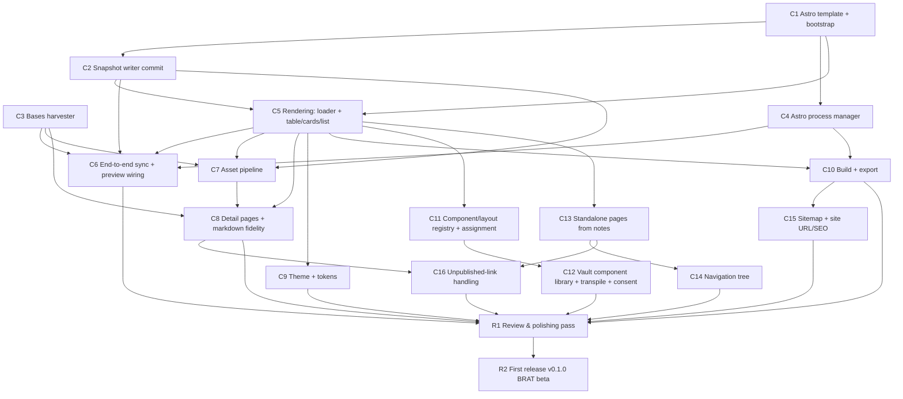

# IMPLEMENTATION_PLAN.md — Specorator Astro Viewer

> Status: **active**. This plan turns the normative spec in
> [`REQUIREMENTS.md`](REQUIREMENTS.md) and the architecture in
> [`DESIGN.md`](DESIGN.md) into **independently shippable chunks**, each sized to be
> driven to completion by a dedicated subagent running a **RALPH loop**, and closed
> out by a **review & polishing pass** (§R1). Vocabulary is in
> [`CONTEXT.md`](../CONTEXT.md).

This file is the _execution_ contract; `REQUIREMENTS.md` remains the _normative_ one.
If they ever disagree, REQUIREMENTS wins and this plan is corrected.

## 0. How to use this plan

### 0.1 The RALPH loop (one per chunk)

A **RALPH loop** runs a single dedicated subagent repeatedly against one stable chunk
spec until that chunk's acceptance criteria are all met. Each iteration:

1. **Re-read** the chunk spec + its acceptance checklist, then `git log --oneline` and
   the working diff to see what is already done.
2. **Pick the smallest next increment** that moves one unchecked criterion toward done.
3. **Implement** it, holding every invariant in §0.2.
4. **Verify** — run `npm run verify` (and `npm run verify:template` for `[template]`
   chunks). If red, fix that before anything else.
5. **Commit** a small Conventional Commit scoped to the chunk (e.g.
   `feat(harvester): read grouped entries from onDataUpdated`).
6. **Re-evaluate** the checklist. If any box is unticked, loop. If all _automatable_
   boxes are ticked, **stop and report** — do not gold-plate.

### 0.1.1 Auto-stop is necessary, not always sufficient

`npm run verify` is Vitest-on-`src/` plus the esbuild build. It **cannot** exercise a
live Bases mount, a spawned Astro dev server, or rendered Astro output. So for chunks
whose **Gate** is marked _(human-gated)_, a green loop proves only the unit/adapter
layer. Such a chunk is **not done** until its documented manual/integration smoke passes.
The loop therefore: runs to `verify` green + every _objective_ box ticked, **records the
manual-smoke steps and their result in the PR**, and hands any box tagged **(human)** to
a reviewer. An agent must never tick a **(human)** box itself.

Each chunk declares a **Gate** describing how it is actually proven:

- **core** — pure logic + unit tests; fully proven by `npm run verify`.
- **adapter** — fs/process adapter proven by a temp-dir/contract test in `npm run verify`.
- **template** — Astro-side code proven by `npm run verify:template` (Astro `check` +
  build against a fixture) plus a visual check **(human)**.
- **integration** — needs a real Obsidian/Bases/process smoke **(human)**; `verify`
  covers only the extractable pure parts.

### 0.2 Invariants (must hold on every iteration of every chunk)

- `npm run verify` stays green; **never** bypass hooks (`--no-verify`, etc.).
- `src/core/**` stays **pure** — no `obsidian`, no `node:*`, no I/O. Enforced by
  `eslint-plugin-boundaries` + `dependency-cruiser`.
- Real logic lives in **deep core modules behind small ports**; adapters stay thin.
  Don't add shallow pass-through modules (see CONTEXT.md "deletion test").
- New `src/core/**` code is **unit-tested with in-memory fakes** (no `obsidian`); core
  branch coverage stays **≥ 90%**.
- The bundled Astro template (`templates/astro/**`) is gated by **`npm run verify:template`**
  (Astro `check` + a fixture build), added in C1 and run in CI. Fast `npm run verify`
  covers the plugin (`src/`); `[template]` chunks must also keep `verify:template` green.
- **Native Obsidian only** (Bases + Web Viewer core plugins); **desktop-only**;
  `child_process` spawns **only the project-local toolchain**, never content-derived
  commands.
- **Conventional Commits** (commitlint-enforced); prefer many small commits.
- When a new domain term crystallizes, add it to `CONTEXT.md`. If a decision changes,
  update the relevant `DESIGN.md` decision (Dn) and `REQUIREMENTS.md` requirement.

### 0.3 Running chunks with subagents

- Launch **one subagent per chunk** using the template in **Appendix A**, pointing it at
  this file and a chunk ID. The agent owns that chunk's RALPH loop end-to-end.
- **Parallelize only** chunks with no dependency edge **and** no overlapping files (see
  the graph in §2). Run parallel chunks in **isolated git worktrees**, then integrate one
  at a time, re-running `npm run verify` after each merge.
- **Sequence** dependent chunks; after a chunk lands, re-baseline (pull, `npm run verify`)
  before launching its dependents.
- A chunk that grows beyond its acceptance criteria should be **split**, not stretched.

### 0.4 Definition of done (per chunk)

- All _objective_ acceptance boxes ticked; **(human)** boxes signed off by a reviewer.
- `npm run verify` green; for `[template]` chunks, `npm run verify:template` green too —
  locally and in CI.
- For `[integration]`/`[template]` chunks, the documented manual smoke passes and is
  noted in the PR (verify-green alone is **not** sufficient — see §0.1.1).
- Tests added per the chunk's "Tests" line; core coverage ≥ 90%.
- Docs touched if the chunk introduced terms/decisions.
- A short PR (or commit series) a reviewer can read in one sitting.

### 0.5 Milestones & release lines

The plan drives the whole plugin to a shippable state. Two release lines:

- **M1 — v0.1.0, BRAT beta (the first release).** Requires **C1–C10** (Phase-1 MVP:
  bootstrap, harvest, write, dev/build, render, sync+preview, assets, detail pages, theme,
  build/export) + close-out **R1** + release **R2**. The earliest point a real user can
  install and use the plugin end-to-end.
- **M2 — v1.0.0, community marketplace.** Adds **C11–C16** (component library, pages, nav,
  sitemap/SEO, unpublished links), re-runs **R1/R2**, and submits via **DIST-MP-7**.

R1 (review) and R2 (release) are **repeatable per milestone**, not one-shot.

### 0.6 Non-functional coverage

NFRs are held continuously, not chunked: desktop-only + `child_process` discipline
(invariants, C4); data-folder isolation & no-data-loss (NFR-3/NFR-9 — C1 never overwrites
user files, C4 always kills the dev server on unload); settings persistence **with a schema
version + forward migration** (NFR-8 — introduced when settings first grow, C4); generated-
site quality (NFR-10 — C5/C9); privacy/network disclosure (NFR-6 — C3/C7 + README in R2);
licensing/namespacing (NFR-11/12, DIST-MP-3 — already satisfied). R1 audits them.

## 1. Where we are now (Phase 0 — done)

Scaffold complete and gated: ports & adapters, route planning (`routing.ts`), the
`SyncSite` and `PreviewSite` use-cases, native-settings config (`SettingsStore` +
`SiteSettingTab`), the full toolchain (esbuild, typed ESLint, Prettier, Vitest,
dependency-cruiser, husky, commitlint, release-please, Dependabot, CI = `npm run verify`).
**All adapters except settings are intentional stubs** that throw "not implemented yet":
`BasesHarvesterAdapter`, `FsSnapshotWriter`, `AstroProcessAdapter`. The chunks below fill
those in and build the Astro side.

## 2. Chunk dependency graph



**Truly-immediate (no deps but C0 baseline):** C1, and C3 (harvester needs only the
existing `ResolvedTarget → ViewSnapshot` contract). **Gate on C1:** C2, C4, C5.
**Parallel-safe once their deps land (disjoint files):** C2 ∥ C3 ∥ C4; after C5,
{C9, C11, C13} and (with C3) C7. **Phase 1 (MVP → M1 first release):** C1–C10. **Phase 2
(full website → M2):** C11–C16. **Close-out (per milestone):** R1 (review) → R2 (release).

## 3. Phase 1 — MVP chunks

### C1 — Astro template + bootstrap

- **Goal:** ship a bundled Astro project template and scaffold it into the plugin data
  folder (`<pluginDir>/astro`) on first run, install dependencies, surface install/build
  errors, and add the template gate. (FR-9, FR-17, FR-11a; DESIGN §5.9, §5.5)
- **Size/Risk:** L / med. **Gate:** integration + template _(human-gated)_.
- **Depends on:** C0 baseline. **Blocks:** C2, C4, C5.
- **Touches:** new `templates/astro/**` (template-owned vs user-owned dirs per FR-11a); a
  `ProjectBootstrapPort` in `core/ports.ts` + adapter; a thin pure `EnsureProject`
  use-case (decide if/what to scaffold); `main.ts` wiring; **packaging** (see Shipping);
  a new `verify:template` npm script + CI step.
- **Shipping (corrected):** BRAT and the Obsidian updater install **only** `main.js`,
  `manifest.json`, and `styles.css` from a release (DIST-BRAT-1 / DIST-MP-2) — loose
  template files in the repo or extra release assets would **not** reach users. So the
  template MUST be **embedded into `main.js`**: a build step serializes `templates/astro/**`
  into a generated TS asset module that esbuild bundles, and the bootstrap adapter **writes
  those embedded files out** into `<pluginDir>/astro`. (`templates/astro/**` stays the
  editable source of truth + the `verify:template` target; it is generated-in, not shipped
  as separate files.)
- **Contract:** `ProjectBootstrapPort.ensureProject(): Promise<{ projectDir: string }>` —
  idempotent; safe to call before every sync/preview.
- **Acceptance criteria:**
    - [ ] `EnsureProject` is pure and unit-tested (decision logic only); file/process work
          lives in the adapter.
    - [ ] `verify:template` (Astro `check` + fixture build of the template) exists, is
          wired into CI, and is green.
    - [ ] A build step embeds `templates/astro/**` into `main.js` (generated asset module);
          bootstrap writes them out. The release stays the 3 standard files (DIST-BRAT-1).
    - [ ] **(human)** On a clean vault the command scaffolds a runnable `astro/`, installs
          deps (`--legacy-peer-deps` per FR-17 when needed), separates template-owned vs
          user-owned dirs, never overwrites user files on re-bootstrap, and reports offline
          install failure rather than swallowing it (D10).
- **Tests:** core `EnsureProject` test with a fake bootstrap port; CI assertion on artifact
  contents.
- **Out of scope:** rendering, harvesting, dev server.

### C2 — Snapshot writer (`commit`)

- **Goal:** implement `FsSnapshotWriter.commit(snapshots)` to atomically replace the Astro
  project's data directory with the given snapshot set. (FR-3; DESIGN §5.2)
- **Size/Risk:** S / low. **Gate:** adapter.
- **Depends on:** C1 (data-dir layout). **Parallel with:** C3, C4. **Blocks:** C5, C6, C7.
- **Touches:** `src/adapters/fs-snapshot-writer.ts` only (port is already
  `commit(snapshots: ViewSnapshot[])`).
- **Contract:** stage to a temp dir, fsync, swap into place; a failed commit leaves the
  previous data dir intact (atomicity owned by the writer, not the caller).
- **Acceptance criteria:**
    - [ ] Writes one JSON file per snapshot under the project data dir, plus any index the
          loader (C5) needs.
    - [ ] Partial failure mid-write never leaves a half-written data dir (temp-dir + swap),
          covered by a test that injects a failure.
    - [ ] Uses `normalizePath` for vault-relative paths; writes via Node `fs` only.
- **Tests:** adapter test using a real temp dir (`node:fs` / `node:os.tmpdir`).
- **Out of scope:** snapshot content (C3); rendering (C5); copying assets (C7).

### C3 — Bases harvester

- **Goal:** implement `BasesHarvesterAdapter.harvest(target)` — register a Bases view,
  mount it transiently, and read evaluated entries from `onDataUpdated` into a
  `ViewSnapshot`, mirroring the chosen view config (type/order/groupBy). (FR-1, FR-2,
  FR-10; DESIGN §5.1) **Highest-risk chunk** — no headless API exists.
- **Size/Risk:** M / **high**. **Gate:** integration _(human-gated)_ + core (mappers).
- **Depends on:** C0 baseline (existing `ResolvedTarget → ViewSnapshot` contract).
  **Parallel with:** C2, C4. **Blocks:** C6, C7, C8.
- **Touches:** `src/adapters/bases-harvester-adapter.ts`; a pure mapper in `core/`
  (Bases `Value` → `CellValue`, grouping shape) behind no new port.
- **Contract:** `harvest(target) → ViewSnapshot` per `domain/types.ts`; pure mapping in
  `core/`; mounting/`onDataUpdated` I/O in the adapter.
- **Acceptance criteria:**
    - [ ] Value→`CellValue` and grouping mappers are pure and unit-tested in `core/`.
    - [ ] Reads view config via `this.config.getOrder()` / `getDisplayName()`; does **not**
          reimplement filters/formulas.
    - [ ] Bases-disabled (`registerBasesView` returns false) surfaces a clear error (FR-10).
    - [ ] **(human)** Mounts a registered view for a real `.base`, waits for
          `onDataUpdated`, returns a populated `ViewSnapshot` (groups/order/values), surfaces
          `ErrorValue`s, and always tears down the transient leaf — even on error.
- **Tests:** pure mapper tests in `core/`; the adapter mount path is exercised manually and
  documented in the PR.
- **Out of scope:** writing to disk (C2), rendering (C5). **If mounting proves impossible,
  STOP and escalate** — this invalidates DESIGN §5.1 and the architecture.

### C4 — Astro process manager

- **Goal:** implement `AstroProcessAdapter.startDev()/build()/stop()` — spawn the
  project-local Astro binary, parse the dev URL from stdout, and **kill the whole process
  tree** on stop; add the dev-port and Node/binary-path settings. (FR-5, FR-6, FR-8;
  DESIGN §5.3)
- **Size/Risk:** M / med. **Gate:** integration _(human-gated)_ + core (URL parse).
- **Depends on:** C1. **Parallel with:** C2, C3. **Blocks:** C6, C10.
- **Touches:** `src/adapters/astro-process-adapter.ts`; settings additions (port,
  Node/binary path) in `SettingsStore` + `SiteSettingTab`.
- **Contract:** `startDev() → { url }` (parsed from stdout, authoritative); `stop()` kills
  the process group and awaits exit; binary path resolved explicitly.
- **Acceptance criteria:**
    - [ ] A pure stdout-URL parser lives in `core/` and is unit-tested.
    - [ ] Settings expose dev-server port (default 4321) and a Node/binary-path override
          (FR-8); the adapter honors them.
    - [ ] Settings gain a **schema version + forward migration** here, as they first expand
          beyond the site config (NFR-8), with a migration unit test.
    - [ ] **(human)** `startDev` launches `astro dev` with port fallback and returns the
          printed URL; `stop` leaves **no** orphaned vite/node process holding the port
          (spawn detached + `process.kill(-pid)` or equivalent); `build` runs and reports
          failure visibly; resolution handles the macOS GUI PATH gap and Windows
          `astro.cmd`.
- **Tests:** core URL-parser test; spawn path smoke-tested manually (documented).
- **Out of scope:** the Web Viewer (done: `WebViewerAdapter` + `PreviewSite`).

### C5 — Rendering: Content Layer loader + table/cards/list

- **Goal:** in the template, load committed snapshots via a Content Layer loader and render
  the native view types **table, cards, list** honoring per-view config. (FR-4, FR-7,
  FR-11e; DESIGN §5.5–§5.6)
- **Size/Risk:** L / med. **Gate:** template _(human-gated)_.
- **Depends on:** C1, C2 (on-disk snapshot shape). **Blocks:** C6, C7, C8, C9, C10, C11, C13.
- **Touches:** `templates/astro/**` (components, loader, routes). No `src/**`.
- **Contract:** consumes the C2 on-disk format; a `glob`/custom loader feeds collections;
  component chosen by `render.component`, defaulting by view type.
- **Acceptance criteria:**
    - [ ] A fixture table/cards/list snapshot builds to a route with correct
          order/grouping/columns, asserted by `verify:template`.
    - [ ] Uses a stable virtual-module/registry barrel so new files dodge Astro's new-file
          HMR gap (D9).
    - [ ] **(human)** Editing a component while `astro dev` runs hot-reloads in the preview
          (FR-11e).
- **Tests:** `verify:template` fixture-snapshot → built-HTML assertions.
- **Out of scope:** assets (C7), detail pages (C8), theme (C9), nav/pages (C13/C14).

### C6 — End-to-end sync + preview wiring

- **Goal:** make "Sync site" and "Preview site" work end-to-end for collections, detect
  disabled core plugins, auto-sync on first preview, and offer a debounced live re-sync of
  the actively-previewed base. (FR-5, FR-7, FR-10, FR-20)
- **Size/Risk:** M / med. **Gate:** integration _(human-gated)_ + core (trigger logic).
- **Depends on:** C2, C3, C4, C5 (and transitively C1). **Blocks:** R1.
- **Touches:** `src/main.ts` (wiring only), `core/usecases/*` (trigger/auto-sync
  orchestration), a sync-trigger toggle in settings. `main.ts` stays domain-logic-free.
- **Acceptance criteria:**
    - [ ] Trigger/auto-sync/debounce orchestration is in core use-cases, fake-tested.
    - [ ] Disabled Bases / Web Viewer core plugins produce a clear Notice (FR-10).
    - [ ] **(human)** "Sync site" harvests every included target and commits; "Preview site"
          ensures the project, starts dev, opens the Web Viewer, auto-syncs first, and the
          preview reflects the synced collections; live re-sync of the previewed base is
          debounced and toggleable (FR-20).
- **Tests:** core trigger/auto-sync tests with in-memory fakes.
- **Out of scope:** build/export (C10).

### C7 — Asset pipeline

- **Goal:** copy vault assets referenced by published entries/bodies into the Astro build
  and resolve `![[embeds]]`/image refs to asset URLs. (FR-16; DESIGN §5.8) MVP per D7.
- **Size/Risk:** M / med. **Gate:** core (resolution) + template (build copies assets).
- **Depends on:** C2, C3 (harvest records referenced assets), C5. **Blocks:** C8.
- **Touches:** harvester (record referenced asset paths in the snapshot), the snapshot
  schema, a pure asset-reference resolver in `core/`, the template's asset handling.
- **Acceptance criteria:**
    - [ ] A pure resolver (vault asset ref → site asset URL/path) lives in `core/`, is
          unit-tested, and dedupes/normalizes paths.
    - [ ] Referenced images/attachments land in the build output and load from the
          generated pages (asserted by `verify:template` on a fixture).
    - [ ] Missing/oversized assets degrade gracefully (logged, not fatal).
- **Tests:** core resolver tests; `verify:template` fixture asserting copied assets.
- **Out of scope:** wikilink-to-page resolution (C8/C16).

### C8 — Detail pages + core markdown fidelity

- **Goal:** every published entry renders its own detail page with the body at core
  fidelity (markdown + frontmatter, `[[wikilinks]]`/`![[embeds]]` resolved to
  routes/assets, callouts). (FR-21, FR-15; D7/D8; DESIGN §5.7)
- **Size/Risk:** L / med. **Gate:** core (route table) + template _(human-gated)_.
- **Depends on:** C3 (bodies in snapshot), C5, C7 (asset URLs for embeds). **Blocks:** C16, R1.
- **Touches:** harvester (include body where needed), snapshot schema, Astro `[...slug]` +
  `getStaticPaths`, a remark/rehype callouts step, route-table logic in `routing.ts`.
- **Acceptance criteria:**
    - [ ] Detail-route derivation + collision detection across the shared `[...slug]`
          namespace lives in the pure route table (extend `routing.ts`), unit-tested (FR-15).
    - [ ] Block refs / transclusions / Dataview are explicitly out of scope and degrade
          gracefully (D8).
    - [ ] **(human)** Each entry has a detail page; bodies render with wikilinks/embeds
          resolved against the route table and callouts rendered.
- **Tests:** extend `core/` route-table tests for detail routes + collisions.
- **Out of scope:** unpublished-link styling (C16).

### C9 — Theme + design tokens

- **Goal:** one polished default theme driven by CSS-variable tokens (light/dark,
  responsive), overridable via a single user `theme.css`. (D9; DESIGN §5.6)
- **Size/Risk:** M / low. **Gate:** template _(human-gated)_.
- **Depends on:** C5. **Blocks:** R1.
- **Touches:** `templates/astro/**` theme/token CSS; user-owned `theme.css` seam.
- **Acceptance criteria:**
    - [ ] `theme.css` overrides win over template tokens with no component edits (asserted
          structurally by `verify:template`).
    - [ ] **(human)** Default theme renders table/cards/list/detail legibly in light & dark
          across a phone/desktop width.
- **Tests:** `verify:template` build smoke; visual check **(human)**.
- **Out of scope:** component scaffolding UI (C11).

### C10 — Build + export

- **Goal:** "Build site" runs `astro build` to `dist/` in the data folder; an
  "Export/Reveal build" action copies it to a chosen location; add the build-output/export
  setting. (FR-6, FR-22, FR-8; D6)
- **Size/Risk:** M / low. **Gate:** integration _(human-gated)_ + core (orchestration).
- **Depends on:** C4, C5. **Blocks:** C15, R1.
- **Touches:** a pure `BuildSite` use-case behind `AstroProcessPort`; an export adapter
  (copy/reveal); export-location setting; `main.ts` commands.
- **Acceptance criteria:**
    - [ ] `BuildSite` orchestration is pure and fake-tested; export-location setting exists
          (FR-8).
    - [ ] **(human)** "Build site" produces a deployable `dist/` (failures visible);
          "Export/Reveal" copies/reveals it to a user-chosen path.
- **Tests:** core `BuildSite` test with fakes.
- **Out of scope:** deploy automation (Phase 3).

## 4. Phase 2 — full-website chunks

### C11 — Component/layout registry, assignment & scaffolding

- **Goal:** discover components/layouts by name (user shadows template), assign per
  base/view via settings dropdowns, scaffold stubs. (FR-11b/c/d; DESIGN §5.6)
- **Size/Risk:** M / low. **Gate:** core (registry/assignment) + integration _(human)_ (UI).
- **Depends on:** C5. **Blocks:** C12, R1.
- **Acceptance criteria:**
    - [ ] Pure registry-resolution (user shadows template) + per-(base,view) assignment
          logic in `core/`, unit-tested; assignment is stored in settings and resolved into
          each snapshot.
    - [ ] **(human)** Settings dropdowns list discovered names; "Scaffold component/layout"
          creates a user-owned stub.
- **Tests:** core registry + assignment tests.

### C12 — Vault component library: code-fence notes, transpilation & consent

- **Goal:** author components as `.astro` code-fence **notes** in a configurable
  `Site/components` folder, transpile them into the project at build, support right-click
  insertion, enforce precedence and no page-leakage — all **behind one-time build-execution
  consent**. (FR-11f/g/h/i/j/k, FR-18; D11; DESIGN §5.6)
- **Size/Risk:** L / **high** (build-time code execution + consent + transpile).
- **Gate:** core (transpile/precedence pure parts) + integration _(human)_ + template.
- **Depends on:** C11. **Blocks:** R1.
- **Touches:** a transpiler (code-fence → `.astro`) with pure parsing in `core/`; a consent
  gate in settings/commands; `Site/components` folder-path setting (FR-8/FR-11f); template
  wiring; right-click menu in an adapter.
- **Acceptance criteria:**
    - [ ] **Consent is a hard gate (FR-18/D11):** build-time-executing code-fence components
          do nothing until one-time consent is granted; revocable; state persisted.
    - [ ] Pure transpile/parse + precedence resolution (user > template, FR-11j) in `core/`,
          unit-tested; non-component notes never leak as pages (FR-11i).
    - [ ] **(human)** A `.astro` code-fence note renders as a component; right-click
          insertion works within the library folder (FR-11k); HMR reflects edits.
- **Tests:** core transpile/precedence/leakage tests.
- **Out of scope:** non-`.astro` DSLs.

### C13 — Standalone pages from notes

- **Goal:** notes designated as pages (frontmatter flag or a configurable `Site/pages`
  folder) become routes; one is the home page (`/`). (FR-12, FR-15, FR-8; DESIGN §5.7)
- **Size/Risk:** M / med. **Gate:** core (routing) + template _(human)_.
- **Depends on:** C5. **Blocks:** C14, C16.
- **Acceptance criteria:**
    - [ ] A page-loader adapter reads designated notes; slug/permalink routing + home-page
          (`/`) selection live in the pure route table, unit-tested (FR-15); `Site/pages`
          folder-path setting exists (FR-8).
    - [ ] **(human)** Designated notes render as pages; the home page resolves to `/`.
- **Tests:** route-table tests for page routes + home selection.

### C14 — Navigation tree

- **Goal:** an ordered, nestable nav curated in settings, with an "add to nav" helper;
  rendered across all pages. (FR-13; D14; DESIGN §5.7)
- **Size/Risk:** S / low. **Gate:** core (resolution) + template _(human)_.
- **Depends on:** C13. **Blocks:** R1.
- **Acceptance criteria:**
    - [ ] Pure nav-resolution (settings nav list → `navigation` snapshot) in `core/`,
          unit-tested; frontmatter/folder structure are optional suggestions only.
    - [ ] **(human)** Nav renders as menu + breadcrumbs across pages.
- **Tests:** core nav-resolution tests.

### C15 — Sitemap + site URL / SEO

- **Goal:** `@astrojs/sitemap` emits `sitemap.xml`; canonical/OpenGraph from the settings
  `site` URL (required at build, warn-don't-fail). (FR-14, FR-23; DESIGN §5.7)
- **Size/Risk:** S / low. **Gate:** template _(human-gated)_.
- **Depends on:** C10. **Blocks:** R1.
- **Acceptance criteria:**
    - [ ] Build emits `sitemap.xml` covering static + `[...slug]` routes; `output: 'static'`
          preserved (asserted by `verify:template`).
    - [ ] Missing `site` URL warns but does not fail dev; build SEO degrades gracefully.
- **Tests:** `verify:template` build smoke asserting `sitemap.xml`.

### C16 — Unpublished-link handling

- **Goal:** wikilinks to notes not on the site render as styled "not published" text with a
  build-warning list; targets are never auto-included. (FR-24; D17)
- **Size/Risk:** S / low. **Gate:** core (resolution) + template _(human)_.
- **Depends on:** C8, C13. **Blocks:** R1.
- **Acceptance criteria:**
    - [ ] Pure link-resolution (on-site vs off-site against the route table) in `core/`,
          unit-tested; no target is ever auto-added (privacy-safe).
    - [ ] **(human)** Off-site wikilinks render as styled plain text and appear in a
          build-warning list.
- **Tests:** core link-resolution tests.

## R1. Review & polishing pass (close-out)

Run **after** the targeted chunks land, as its own pass (not inside a feature loop):

1. **Architecture review** through the module-depth lens (the
   `improve-codebase-architecture` skill): hunt shallow modules, leaky seams, and
   concept-bouncing introduced while shipping; apply the deletion test. Fix the strong
   candidates.
2. **Security review** (the `security-review` skill): the `child_process` surface (only
   project-local toolchain, never content-derived commands), the **code-fence consent gate
   (FR-18/D11)**, file I/O outside the vault, and network access; confirm README
   disclosures (NFR-6).
3. **Test & coverage audit:** core ≥ 90% branch coverage holds; adapters have
   smoke/contract tests; `verify:template` covers the rendered surface; remove dead code
   and any `not implemented` stubs that shipped.
4. **Docs sync:** reconcile `DESIGN.md`/`REQUIREMENTS.md`/`CONTEXT.md`/`README.md` with what
   was built; record new decisions (Dn) and terms; tick this plan's boxes.
5. **Dependency & release hygiene:** clear the Dependabot queue; confirm release-please
   bumps `package.json` + `manifest.json` together and `versions.json` is correct.
6. **Full manual smoke** (the `verify`/`run` skills): bootstrap → sync → preview → edit →
   build in a real vault; confirm the golden path, the FR-10 disabled-plugin paths, and the
   consent gate.
7. **Gate:** `npm run verify` **and** `npm run verify:template` green locally and in CI;
   open a clean PR.

Done when review findings are resolved or explicitly deferred (with an ADR/decision note),
docs match reality, and both gates are green.

## R2. First release (milestone M1 — v0.1.0, BRAT beta)

Cut a real, installable beta once R1 is green. **Gate:** integration _(human-gated)_.

- **Depends on:** R1 (and thus C1–C10). **Touches:** `README.md`, `manifest.json` /
  `versions.json`, the release workflow, GitHub release assets.
- **Acceptance criteria:**
    - [ ] **Template is embedded in `main.js`** (per C1) so the standard assets carry
          everything; the release attaches **`main.js`, `manifest.json`, `styles.css` only**
          (DIST-BRAT-1).
    - [ ] A **release workflow** builds `main.js` (production) + runs both gates on the tag
          and **uploads the three assets** to the GitHub release (release-please cuts the
          tag; it does not build/attach assets by itself).
    - [ ] Release **tag = release name = manifest `version`** (semver, no leading `v`);
          `versions.json` maps it to `minAppVersion` ≥ **1.10.0** (DIST-BRAT-2, DIST-MP-5/6).
    - [ ] `README.md` covers BRAT + manifest install, native-only scope, required core
          plugins (Bases + Web Viewer), the Node/Astro prerequisite, and **discloses network
          use + out-of-vault file access** (DOC-2, NFR-6); `LICENSE` + `manifest.json`
          present (DIST-MP-1).
    - [ ] **(human)** Install the released build via **BRAT into a clean vault** and run the
          golden path (bootstrap → sync → preview → build) plus the FR-10 disabled-plugin
          messaging. This is the release sign-off.
- **Out of scope:** marketplace submission (deferred to M2).

> **M2 (marketplace, v1.0.0):** after C11–C16 + a second R1/R2, submit via the community
> plugin flow (PR to `community-plugins.json`, DIST-MP-7), expecting the automated bot plus
> manual review of the `child_process`/network surface (DIST-MP-7).

## Appendix A — subagent launch prompt template

```
You are implementing ONE chunk of docs/IMPLEMENTATION_PLAN.md in
/home/user/specorator-astro (an Obsidian desktop plugin; ports & adapters; core is pure).

Chunk: <C-ID and title>.

Read first: docs/IMPLEMENTATION_PLAN.md (§0 invariants, §0.1.1 on gates, and your chunk's
spec), AGENTS.md, CONTEXT.md, and the DESIGN.md/REQUIREMENTS.md sections the chunk cites.

Run a RALPH loop until your chunk's OBJECTIVE acceptance boxes are met:
  1) re-read the chunk's acceptance checklist + `git log --oneline` and the diff;
  2) implement the smallest next increment;
  3) run `npm run verify` (and `npm run verify:template` if your chunk is [template]) and
     make it green (never bypass hooks);
  4) commit a small Conventional Commit scoped to the chunk;
  5) repeat until every OBJECTIVE box is satisfied, then STOP and report.

Do NOT tick any box marked (human) — instead, document the manual-smoke steps a reviewer
must run and your best evidence. Hold every invariant in §0.2 (core purity, ≥90% core
coverage with in-memory fakes, native-Obsidian-only, desktop-only, thin adapters/deep
core, template gated by verify:template). Do NOT exceed the chunk's scope; if it must
grow, stop and propose a split. If a documented assumption proves false (e.g. C3
mounting), STOP and escalate rather than working around it.

Report: what you implemented, the objective-checklist state, the (human) boxes left with
their smoke steps, and the `npm run verify`(/`verify:template`) result.
```
